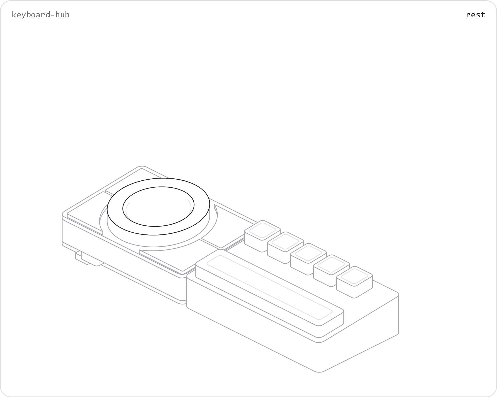
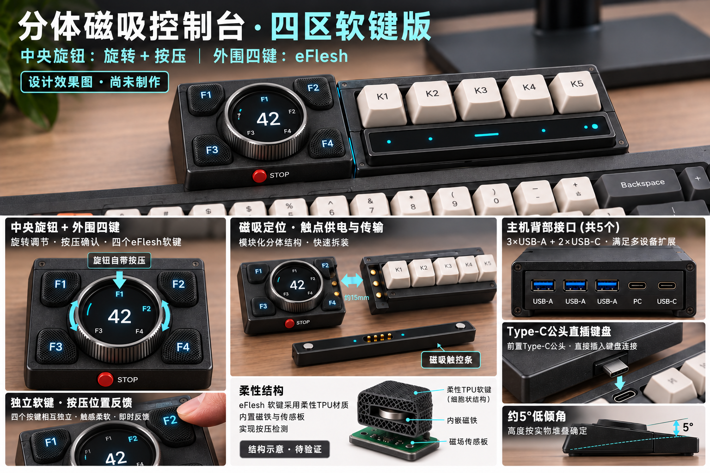

# Keyboard as PC Hub

ESP32-S3 圆屏控制台＋键盘直插 USB Hub。独立主机、右侧磁吸五键模块、独立磁吸触控条；先验证散件，再集成主 PCB。

**当前版本 R2：左侧①④小、右侧②③横向加长，圆屏和四个感应中心保持固定。外环只旋转，中央屏幕可触控和独立按压。**

## 交互结构展示

[下载／查看单文件HTML](visualization/hairline-keyboard-hub.html) · [使用方法与检查记录](visualization/README.md)

下载HTML后直接用浏览器打开，无需安装。悬停主机看分层；点击固定，再点同处或空白复位。悬停右侧五键或触控条看磁吸分离。滑块改变展示间距，`play`自动导览。GitHub README只显示静态图，不运行HTML交互。

## 当前尺寸

| 项目 | 布局候选，mm |
| --- | --- |
| 主机外壳 | 102×68；5°；前高20、后高25.95（不含突出控件） |
| 主 PCB | 96×62×1.6；尚未验证器件装配 |
| 旋转环／屏体／有效区 | Ø60／Ø44.32／Ø38.16 |
| 环开口／可见边框 | Ø41.76／单边1.8 |
| 四键感应中心 | (−36,+22)、(+36,+22)、(+36,−22)、(−36,−22) |
| 左右键面 | 右侧向外多伸6；未倒圆面积比约1:1.37 |
| 主体四软键外露高度 | 目标0.3，基本齐平；右侧五个机械键保持原高度 |
| 右侧附件／拼合占地 | 112×68／215×68，均为展示包络 |

**2026-10-09：资料研究与散件验证阶段。没有制造放行的PCB、CAD或整机验收结果。** GPIO及已验证状态见现有硬件记录。

## 详细资料

1. [R2结构、坐标和尺寸](mechanical/dimensions-r2.md)：当前机械基准及未核实项目。
2. [键盘接口兼容性研究](docs/keyboard-compatibility.md)：公开端口资料、可调公头与主板尺寸边界。
3. [接口与供电](docs/ports-and-power.md)：背部3A＋PC-C＋POWER-C、左侧FAST-C、键盘公头。
4. [已有硬件与GPIO](hardware/current-wiring.md)：保留用户11个GPIO分配。
5. [功能、散件验证及单板集成](docs/product-and-integration.md)。
6. [接口调查表](hardware/keyboard-port-survey.csv)与[当前机械参数](mechanical/interface-parameters.json)。

主机使用现有N16R8、360×360圆形触控屏、MAX98357A及扬声器。外围四块eFlesh软键、五宏键和触控条可配置；独立视觉节点识别手势，经ESP-NOW传输。高速数据走独立Hub，ESP32作为下游HID；FAST与其他外设共享上行带宽。

## 历史资料

以上旧效果图不代表R2键面、接口标识或制造尺寸。[R0结构](mechanical/dimensions-r0.md)、`设计图/`、`Functions/`、`STM32F103C8T6/`均保留作历史参考；原示例不是当前ESP32固件。[此前首页](docs/history/README-before-2026-10-09.md)保留原始思路。
