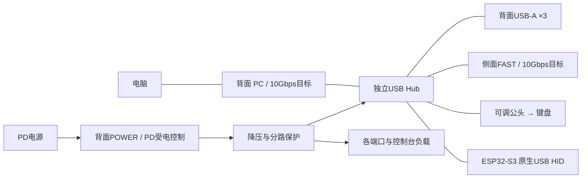

# 接口、数据与供电分工

日期：2026-10-09。首轮架构目标，尚未打样或测量功耗。

## 端口安排

| 位置/丝印 | 接口 | 职责 |
| --- | --- | --- |
| 背面 PC | Type-C母口 | 连接电脑，目标USB 10Gbps上行；明确为上行口 |
| 背面 POWER | Type-C母口 | 外部PD电源输入，仅供电，不作为外设数据口 |
| 背面 A1/A2/A3 | USB-A母口×3 | 常规外设数据与5V供电；速度随选定Hub能力，建议至少5Gbps |
| 侧面 FAST | Type-C母口 | 单独的高速外设口，目标USB 10Gbps＋5V供电，优先给SSD/采集设备 |
| 可调连接端 KBD | Type-C公头 | Hub下游直插键盘，初版USB 2.0数据＋5V供电 |
| 内部 CTRL | 原生USB连接 | ESP32-S3作为USB HID设备 |

因此仍为背面3A＋2C；**新增的FAST是第三个外部Type-C，安排侧面**。POWER不计入数据下游端口数量。FAST是独立物理接口，不是独享10Gbps带宽；它与其他外设共享电脑上行。电脑、线材或Hub仅支持5Gbps时会降速。此方案不承诺USB4、雷电、显示输出或给笔记本反向充电。

高速USB数据直接经过Hub，不能经过ESP32再转发。ESP32只是其中一个下游设备；按键、触控条、eFlesh经低速总线接ESP32，不额外占Hub口。视觉节点保持独立供电，若改从本机USB供电需重新计算端口与电流。

至少需要六个下游数据连接：A×3＋FAST×1＋键盘×1＋ESP32×1。一个四口Hub不够；可用符合要求的多口模块，或在验证阶段用合适的级联方案。

## 散件与集成方向

散件阶段：选带独立供电的USB 10Gbps Hub，核对上下行规格、实际内部拓扑、外设同时工作能力和端口电流。已有5Gbps Hub可测试枚举和功能，不能据此通过10Gbps验收。

集成研究候选：Microchip USB7206，官方资料为五个USB 3.2 Gen2下游＋一个USB 2.0下游，支持10Gbps上行路线，端口数量与本方案相符。可将USB 2.0口给ESP32，五个其余口分配A×3、FAST、键盘（键盘仅使用其USB 2.0通道）。这只是架构候选，不是已完成选型或现成可焊电路。[官方数据手册](https://ww1.microchip.com/downloads/en/DeviceDoc/00002875C.pdf)

Type-C还需对应的CC角色检测、翻转处理/高速开关、端口电源开关、ESD及受控阻抗走线；Hub芯片型号本身不提供完整接口或电源设计。最终集成前按所选板厂层叠与厂商布局要求设计，不能使用杜邦线拼10Gbps差分通道。

## 首轮供电预算

为了在连接电脑时稳定带动键盘和外设，采用自供电Hub。电脑上行保留规定的连接检测与VBUS监测，不把外部电源直接并到电脑VBUS。未接POWER时首版不保证全功能，也不宣称自动无缝切换。

下表是预留预算，不是实测功耗，也不是已经实现的USB供电宣告：

| 负载 | 5V预算 | 功率 |
| --- | ---: | ---: |
| 三个A口，各0.9A | 2.7A | 13.5W |
| FAST口 | 1.5A | 7.5W |
| 键盘支路 | 1.5A | 7.5W |
| N16R8、圆屏、音频及低速模块 | 1.0A | 5W |
| Hub本体及辅助电路等效预留 | 0.5A | 2.5W |
| 合计 | 7.2A | 36W |

以80%额定负载规划，内部转换能力至少45W，即5V/9A等级；优先研究**支持20V/3A档位的60W级PD输入**，再降到系统5V及3.3V。60W不是直接输给键盘，20V绝不能接ESP32、屏幕或功放。还须检查转换效率、器件温升、每路开关、铜箔、连接器和线材额定值。

各口实际可提供电流需符合协商/枚举结果：不能只因电源够大就强行输出或宣称电流。特别是USB 2.0键盘、Type-C电流宣告、USB-A枚举前后限制需分别实现。功耗较高的SSD或其他设备可能超出FAST预留，应实测后调整，不能保证所有外设组合。

散件阶段优先沿用有源Hub原配电源及内建管理；若用PD受电模块，必须匹配支持的电压档、足额降压和反灌隔离，不能仅凭手机充电器标称瓦数判断。

## 验收

- 电脑同时识别键盘、ESP32 HID和三个A口设备。
- FAST接合适SSD并与键盘/屏幕/音频并发，检查掉盘、重枚举、输入丢失。
- 记录实际协商速率、有效吞吐、5V压降、总电流和热点温度；10Gbps是链路速率，不是保证文件复制速度。
- 插拔POWER、电脑休眠/唤醒、USB外设突加载荷时不反灌、不产生卡键；首版允许有序重新枚举，不承诺无缝供电切换。
