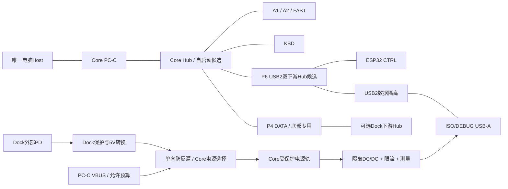

# 当前接口与供电：R3.1 Core＋可选Power Dock

2026-10-31更新右后隔离调试口。本页替代原R3单体必接PD的方案。详细依据见[交接基准](R3_1_CODEX_HANDOFF.md)、[差异决策](R3_1_DECISIONS.md)、[工程评审](R3_1_ENGINEERING_REVIEW.md)和[新增ISO口决定](iso-debug-r3-1.md)。

| 接口/逻辑口 | 位置与角色 | 约束 |
| --- | --- | --- |
| PC-C / 上行 | Core背部X≈+64候选；唯一电脑数据上行、VBUS输入 | CC Sink/方向、SS Mux、ESD、合规取电/检测、防反灌；Core无20V受电口 |
| A1/P1、A2/P2 | Core背部X≈−91/−64 | USB-A 3.x下游；限流与可用电流须重算 |
| FAST-C/P3 | 左侧Y≈+17 | USB 10Gbps目标，下游Source与翻转；不默认承诺5V/3A |
| DOCK/P4 | Core底部 | 专用USB3+USB2 DATA链路，Rev A未接时空置；不是第二上行 |
| KBD/P5 | 独立可调公头 | USB2键盘，正确CC/翻转及独立承载 |
| USB2分支/P6 | Core内部 | 双下游USB2 Hub候选；P6a保留ESP32 CTRL，P6b通往隔离器；自启动/预算待验 |
| CTRL/P6a | Core内部 | ESP32-S3原生USB Full-Speed HID；保留GPIO19/20，不删原功能 |
| ISO／DEBUG/P6b | Core背部最右X≈+91候选 | USB-A隔离调试输出；USB2 480 Mbps目标、隔离5V/硬件保护/测量；开孔和供电额定未冻结 |
| DOCK PWR/CTRL | 底部专用接口 | Dock单向输出受保护5V给Core；独立管理与检测，封装/量程TBD |
| MAG-L/R | 两端8点 | 仅低速低功耗，不作USB3/Dock全机供电接口 |

Core不再保留A3和POWER IN-C。Rev B Dock有自己的外部PD输入、降压保护和下游Hub；其数据由Core P4进入唯一电脑上行。手机高压PD充电、读卡、电池、第二Host、双向供电不在本版。

```mermaid
flowchart LR
 PC[唯一电脑Host] --- UP[Core PC-C]
 UP --- HUB[Core Hub / 自启动候选]
 HUB --- A[A1 / A2 / FAST]
 HUB --- K[KBD]
 HUB --- B[P6 USB2双下游Hub候选]
 B --- M[ESP32 CTRL]
 B --- DI[USB2数据隔离]
 DI --- DBG[ISO/DEBUG USB-A]
 HUB --- P4[P4 DATA / 底部专用]
 P4 --- DH[可选Dock下游Hub]
 PD[Dock外部PD] --> DP[Dock保护与5V转换]
 DP --> PSEL[单向防反灌 / Core电源选择]
 VBUS[PC-C VBUS / 允许预算] --> PSEL
 PSEL --> CORE[Core受保护电源轨]
 CORE --> IP[隔离DC/DC + 限流 + 测量]
 IP --> DBG
```

USB7206C的5个Gen2+1个USB2下游只匹配原六路；新增P6b须经真实级联Hub或重新选择主Hub，不能由端口数量冻结物理管脚/供电模式；官方启动、额外电源轨及功耗已列入[WP1审查](R3_1_ENGINEERING_REVIEW.md)。Core自身峰值未知，旧100W输入/46W预算不能继承。必须检测上游实际能力、扣除Core损耗并满足USB枚举/挂起规则；不能默认所有外设同时满载。

PC VBUS与Dock 5V禁止硬并联或反灌，P4数据参考VBUS也不能充当Dock大电流回供。拔插Dock不承诺SSD写入不中断；配置/电源切换可能需要受控重枚举。保护需硬件自主，ESP32只显示真实测量和允许的控制项。

[选型CSV](../hardware/electronics/dock-port-selection.csv) · [R3.1参数](../hardware/enclosure/interface-parameters-r3-1.json) · [底视/剖面](../design/drawings/dock-interface-r3-1.svg)。具体料号和封装未冻结，原KiCad载板J9仍只允许5V。

[ISO调试口完整拓扑、物料与机械冲突](iso-debug-r3-1.md)为新增要求；隔离口不得将ISO_GND与Core_GND硬连，也不得使用八点MAG供电或数据。
