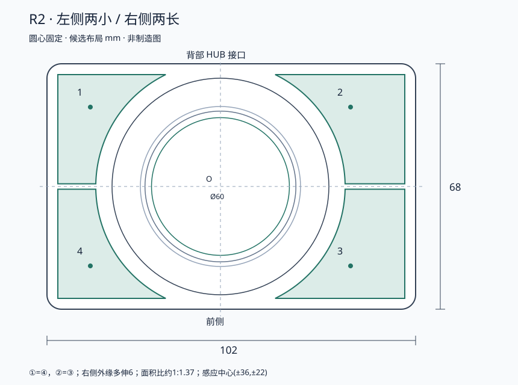

# R2：左小右长的结构与尺寸基准

2026-10-09。单位 mm。状态：**用户确认的布局候选，不是制造放行尺寸**。本页替代 R0 和未发布的 R1；屏幕按圆形处理，禁止沿用方形屏幕对角线推导。

## 坐标、外壳和四键

圆屏中心 O=(0,0)，X 向右，Y 向背部接口，Z 向上。壳体尺寸为水平投影；圆屏与环的直径为零件本身尺寸，展示图随操作面倾斜，不是完整加工图。

| 项目 | R2 规划值 |
| --- | --- |
| 主机外壳 | 102×68；X=[−48,+54]，Y=[−34,+34] |
| 顶面 | Z=20+(Y+34)×tan(5°)；前高20、后高25.95，不含突出控件及脚垫 |
| 圆角／壁厚／底厚 | R4／2.4／2.4 |
| 主 PCB 包络 | 96×62×1.6；X=[−45,+51]，Y=[−31,+31]；候选，不承诺开发板整板可装入 |
| 主 PCB Z 基准 | 底面6.4、顶面8.0；底板2.4、支柱4.0 |
| 旋转环 | 外径60；只旋转，不按压 |
| 左侧①④ | 外边界X=−45 |
| 右侧②③ | 外边界X=+51；相对左侧镜像向外增加6 |
| 四键内侧凹弧 | 与屏幕同心，R34.5；至Ø60外环名义平面间隔4.5 |
| 主体四软键露出面板高度 | 目标0.3，基本齐平；用户要求上限1；内部弹性结构及行程待样件验证 |
| 五机械键帽露出面板高度 | 9，保持原先五键外形；本次降高仅针对主体四软键，实物轴帽堆叠仍待验证 |
| 上下键间隔／外边界 | Y=[−31,−0.75]或[+0.75,+31]，间隔1.5；外侧角R1 |
| 感应中心 | ①(−36,+22)、②(+36,+22)、③(+36,−22)、④(−36,−22) |

①=④、②=③，分别关于X轴镜像；左右不等大。四键轮廓是相应矩形减去中央R34.5圆形的结果。未倒圆面积分别约488.01和669.51 mm²，比例1:1.372。右侧仅拉长表面轮廓，圆心、内凹弧和感应中心不随之移动。外壳几何中心位于圆心右侧3 mm，不重新居中屏幕。

传感器小板仅以14×14包络表示；型号、磁体数量/位置、软结构厚度、位置识别精度均须按 eFlesh 样件标定。较大键面不会自动扩大单传感器有效范围；必须实测右侧最远端按压和跨键串扰。

## 圆屏、外环和独立按压

| 部件 | 规划尺寸／行为 |
| --- | --- |
| 屏体 | Ø44.32，IPS，360×360；AA Ø38.16 |
| 厚度 | 保留3.5安装预算；用户图中侧面尺寸链可能合计2.65，未经确认不减预算 |
| 驱动 | ST77916/JD9855标识待实物确认，不据外形图选定驱动 |
| 上部环开口 | Ø41.76；与AA单边差(41.76−38.16)/2=1.8 |
| 环唇覆盖非显示边缘 | (44.32−41.76)/2=1.28/边，需检查触控走线和装配公差 |
| 下部避让孔／活动托架 | Ø50／Ø49；径向名义间隙0.5/边 |
| 屏体口袋 | Ø45，屏体单边名义余量0.34 |
| 环上表面 | 高出操作面8；玻璃低于环顶约1.8 |
| 环唇 | 初样厚1；唇底至玻璃静态0.8，最差倾斜/公差位置目标≥0.3，待试装 |
| 中央机械按压 | 目标触发约0.3、硬限位0.6；整屏触发力目标2–3N，尚未实测 |

屏幕托架周边承力，三点弹性支撑、圆孔/长槽导向防转、独立限位。玻璃和屏幕背部不直接承受开关顶压。屏幕下压时远离环唇；外环旋转时屏幕不转动，排线不跟转。

旋转机构采用独立的光学读码、段落定位和滚动支撑研究方向，三者不能共用有齿滚道。具体轴承、读码盘、弹片、相位与力矩未验证，HTML只表达装配关系，不表示这些零件已完成设计。

FPC图示39.98/41.93是投影伸出量，不是自由弯曲长度。排线向下再向后布置，活动段留按压余量并做两端应力释放；完整背板、插座朝向和厚度、安装孔、弯折半径仍须测量。1.8可见边框与0.5运动间隙是不同尺寸，不可混用。

## HUB、分体和公头

背部USB-A×3、PC-C上行、POWER-C供电；左侧FAST-C高速下游；可调Type-C公头给键盘提供USB 2.0数据和5V。FAST与其他外设共享上行，不承诺独占带宽。电气职责以[端口与供电](../docs/ports-and-power.md)为准。

展示用背部端口X中心为−35/−15/+5/+22.5/+37.5，均按主机坐标而非背视镜像；插座内部保留约16 mm深度。开孔高度、连接器封装、PD和高速走线须在真实PCB布局后复核，这些坐标不是开孔加工依据。

主机右侧磁吸五键模块暂沿用112宽、深度改为68，连接缝1，拼合占地215×68。五机械键间距19.05。独立触控条展示包络104×22×8，放在右模块前部，可独立拆出；附件内部不在本轮HTML展开范围内。

磁铁负责吸合，定位件负责侧向力，弹簧触点负责供电与信号，止挡决定合拢距离。接点数量和电气引脚未定，图中接点仅表达连接方式。公头沿用窄颈/可调承载方案，不焊死在主板边沿；主机独立承力，不由键盘母口承重。

## 功能和制造边界

- 主机显示/触控/音频沿用[当前接线](../hardware/current-wiring.md)，不重新分配已占用11个GPIO。
- 短机械按压确认，长按目标700 ms返回；机械按压触发后取消本次待发触摸点击，抬手前不重复发送。
- 前侧STOP停止生成输入并释放保持键，不切断物理键盘的Hub连接。
- 装配验证包括整圈运动净空、偏心按压、FPC活动、背部插座与感应模块的高度干涉、磁干扰、PD功耗/散热和高速信号。
- 单板集成按散件验证结果开展；本轮无完成的原理图、布线、Gerber、可制造CAD或实物通过声明。

参考：用户提供的圆屏尺寸图为屏体依据；[eFlesh](https://github.com/notvenky/eFlesh)用于软键结构与标定研究；[HALO TOUCH作者说明](https://pressf5.run/?p=227)用于低矮底座和圆屏旋钮风格参考，不声称其内部结构已开源或已复刻。
