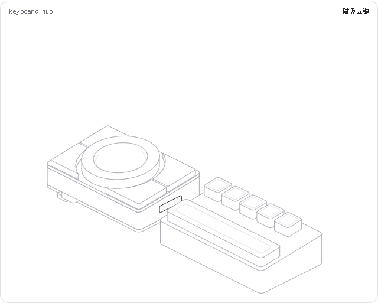
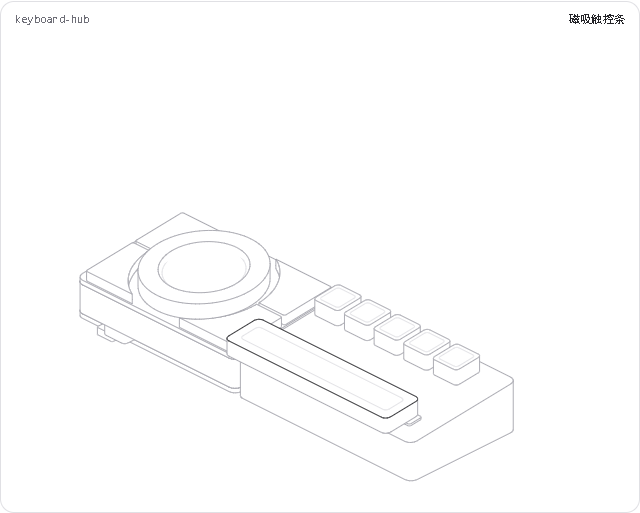

# R2 Hairline 结构展示

[打开／下载HTML](hairline-keyboard-hub.html)；下载后直接打开，可离线使用。[绘图源码](keyboard-hub.js)保留参数化几何。[机械尺寸](../mechanical/dimensions-r2.md)是结构说明入口。

## 如何查看

- 静止：完整主机、左侧两小键、右侧两长键、圆屏旋转环和右侧五键模块。
- 悬停主机：纵向分离主板、上壳、四块感应板、屏幕托架、显示屏及四软键/外环；屏幕和感应中心平面位置不变。
- 悬停中央：展开并突出屏幕托架；这是结构查看，不是旋转或按压的固件模拟。
- 点击：固定当前展示；再次点击同一区域或空白复位。固定时移出鼠标不折叠。
- 悬停五键模块：向右分离，露出主机连接面的磁吸/接触位置。
- 悬停触控条：向上提起并向前分离，露出定位和接点。附件不展开内部结构。
- 滑块：展示分离距离8/16/24 mm；不会修改产品尺寸。`play`按主机→屏幕托架→磁吸五键→触控条→静止导览。





## 实现与边界

使用用户指定的hairline-create技能及其固定kernel/bench，未修改引擎或页面模板。绘图只使用HL输入、生命周期和动画工具；遵循固定命中区、单处线条高亮、实体遮挡、静止停帧、圆角及图内无文字的规则。源码不超过200行。

左/右键面外缘−45/+51、共心R34.5凹弧，外角R1；源码离散轮廓面积约487.70/669.20 mm²，面积比约1:1.372。机械文档488.01/669.51是未倒圆积分值，两者差异来自倒圆和圆弧离散。

屏幕厚度按3.5预算；三点支撑、导向、防转和限位仅表达结构关系。PCB上的芯片、插座、触点和磁体是功能/包络占位；没有完成电气引脚、生产孔位、应力/FPC弯折、温升、USB信号或磁传感校准验证。显示图不能用作加工图或Gerber。

### 重建

安装Node.js，并将用户的hairline-create技能目录设置为`HAIRLINE_SKILL`。在此目录运行：

```powershell
node "$env:HAIRLINE_SKILL/build.mjs" keyboard-hub.js
node "$env:HAIRLINE_SKILL/validate.mjs" hairline-keyboard-hub.html
node "$env:HAIRLINE_SKILL/look.mjs" keyboard-hub.js --answer 0,0,31 --edge 45,0,23 --zoom rest
node check-interactions.cjs
```

`look.mjs`安装并使用playwright-core。Windows上可将`HAIRLINE_LOOK_CACHE`设置为不含空格、位于仓库外的可写目录；附加检查复用该缓存，使用本机Chrome。检查脚本是开发工具，不是打开HTML所需依赖。

## 验收记录

- 技能校验：内嵌引擎和模板一致、无外部请求、合法动画/输入接口、200行上限。
- 浏览器八状态：默认、分层、小尺寸及响应、间距两端、深浅主题；检查取景、稳定性、读数和控制台。
- 附加检查：左右键面比例和凹弧、固定感应中心、展开时平面位置、点击固定/同处复位/空白复位、两种磁吸分离、四个命中区域的滑块两端、导览顺序、play启动、减少动态效果、离线加载及destroy清理。
- 目检：装配轮廓、五个键帽、凹弧键面、屏幕与托架分层、连接面及遮挡。240px下细接点不作可读尺寸标注，以完整尺寸图为准。

[八状态检查图](hairline-keyboard-hub-look.png) · [小尺寸无标题检查](hairline-keyboard-hub-blind.png) · [动画过程检查](hairline-keyboard-hub-motion.png)
